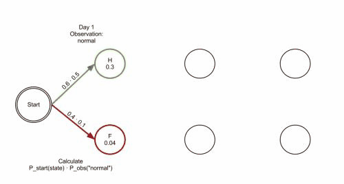

# varscan-hmm

A SNP and indel variant caller using Hidden Markov Models (HMMs) to better account for positional independence and linkage disequilibrium between genetic loci.

## Table of Contents

- [Contributors](#contributors)
- [So...what is a Hidden Markov Model? (Methodology)](#sowhat-is-a-hidden-markov-model-methodology)
  - [What is the Viterbi Algorithm?](#what-is-the-viterbi-algorithm)
    - [Viterbi Algorithm Animated](#viterbi-algorithm-animated)
  - [Application of HMMs in Tang et al. (2019)](#application-of-hmms-in-tang-et-al-2019)
    - [Learning Resources](#learning-resources)
- [How do I run it?](#how-do-i-run-it)
  - [Requirements](#requirements)
  - [Installation](#installation)
  - [Usage](#usage)
  - [File Formats](#file-formats)
- [Why should I run it? (Benchmarking Analysis)](#why-should-i-run-it-benchmarking-analysis)

## Contributors

- Gary Lin (A16915179)
- Lorenzo Olmo Marchal (A17013640)
- Nabeeha Rashid (A16851960)

We aim to implement the methods outlined by Tang, et. al (2019) in their [publication](https://humgenomics.biomedcentral.com/articles/10.1186/s40246-019-0194-6) in *Human Genomics*, open access of which is provided under the [Creative Commons Attribution 4.0 International License](http://creativecommons.org/licenses/by/4.0/). This project is intended to be our final project in CSE 185: Advanced Bioinformatics Laboratory for the Spring 2024 quarter, to be presented to our peers and Professor Melissa Gyrmrek.

> <cite>Tang, M., Hasan, M., Zhu, H. et al. vi-HMM: a novel HMM-based method for sequence variant identification in short-read data. Hum Genomics 13, 9 (2019). https://doi.org/10.1186/s40246-019-0194-6</cite>

## So...what is a Hidden Markov Model? (Methodology)

A Hidden Markov Model (HMM) is a statistical model that represents systems with hidden states through observable events. It consists of the following components:

1. **States:** Each state represents a possible condition or part of the system being modeled. In our case, states could represent the underlying genotypes (e.g., homozygous reference, heterozygous, homozygous variant).
2. **Observations:** These are the data or evidence that we can observe. For SNP calling, observations are the nucleotides found in the sequenced reads.
3. **Transition Probabilities:** The probabilities of moving from one state to another. These probabilities define how likely it is for one genotype to follow another.
4. **Emission Probabilities:** The probabilities of observing a particular nucleotide given a state. For instance, given a heterozygous state, the probability of observing each possible nucleotide.
5. **Initial Probabilities:** The probabilities of the system starting in each state.

HMMs are particularly useful in sequence analysis because they can handle variability and uncertainty in the observed data by leveraging the probabilistic nature of state transitions and emissions.

### What is the Viterbi Algorithm?

The Viterbi algorithm is a dynamic programming algorithm used to find the most likely sequence of hidden states while given a sequence of observed events. The algorithm proceeds in the following steps:

- Initialization: Set up the initial probabilities of being in each state at the start.
- Recursion: Iteratively compute the most probable state sequence up to each point in the observed sequence using the transition and emission probabilities.
- Termination: Identify the most likely final state and backtrack to reconstruct the sequence of states that led to this state.

In the context of HMMs for SNP calling, the Viterbi algorithm helps in determining the most likely sequence of genotypes that could have produced the observed sequence of nucleotides.

#### Viterbi Algorithm Animated

Hover over the images for citation information.

. Animation of the Viterbi algorithm on a trellis illustrating the data association process. The accompanying animated GIF file contains an animation of the Viterbi algorithm on a trellis illustrating the data association process used in the Viterbi data association (VDA) tracking algorithm. Time is horizontal and states are vertical. The states correspond to data association events: -1 - no track; 0 - false alarm; i>0 - measurement i is the target. The algorithm proceeds by finding the least cost path to each node at the current time. (For clarity, path costs are not included.) Paths that do not survive the minimisation process are pruned. As the animation progresses, the paths share a common history before a certain time instant. This illustrates the idea of merging in the Viterbi trellis. For a communications system, the number of states is fixed. For VDA, it can vary.")

### Application of HMMs in Tang et al. (2019)

In the paper by Tang et al., HMMs are used to identify sequence variants (SNPs and potentially indels) in short-read sequencing data. Here's a small breakdown of how HMMs are used in their research:

1. ***Genotype Inference***
   - Tang et al. developed a Hidden Markov Model to infer the most likely sequence of genotypes (hidden states) from observed nucleotide sequences. They modeled the process of sequencing, where each observed nucleotide is an emission from a hidden genotype state. This allowed them to probabilistically determine the underlying genotypes.

2. ***Variant Calling***
   - The core application of their HMM is in variant calling, specifically for identifying SNPs. By modeling genotypes as hidden states and observed nucleotide reads as emissions, the HMM can accurately determine the positions in the genome where variants (SNPs) occur.

3. ***Handling Sequencing Errors***
   - The paper discusses how the HMM framework incorporates emission probabilities that take sequencing errors into account. This helps differentiate between true genetic variants and errors introduced during the sequencing process, improving the reliability of variant calls.

4. ***Complex Genomic Regions***
   - Researchers in the paper emphasized the effectiveness of HMMs in analyzing complex genomic regions. These regions, which may have high variability or structural complexity, pose challenges for conventional variant calling methods. The HMM’s ability to manage multiple hidden states makes it suitable for resolving variants in these difficult areas.

5. ***Comparative Performance Analysis***
   - In their study, the performance of the HMM-based variant caller (vi-HMM) was compared to other tools. They used the Viterbi algorithm to decode the most likely sequence of hidden states (genotypes) and evaluated the accuracy, sensitivity, and computational efficiency of their method relative to existing variant callers.

### Learning Resources

Here are some resources that may help to explain/demonstrate how HMMs and the Viterbi algorithm work (click to watch):

- An easy introduction to Hidden Markov Model (HMM) by Video Castle: 
- Hidden Markov Models 11: the Viterbi algorithm: 

## How do I run it?

### Requirements

### Installation

### Usage

You need a mpileup file

### File Formats

## Why should I run it? (Benchmarking Analysis)
